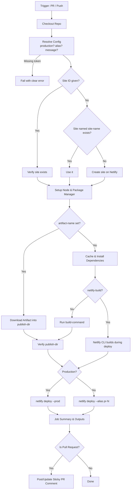

<p align="center">
  
</p>

<h1 align="center">netlify-deploy</h1>

<p align="center">
  <strong>A reusable GitHub Actions workflow to build your site and deploy it to Netlify. It creates preview deploys for Pull Requests, production deploys for your main branch, and posts the preview URL as a sticky PR comment.</strong>
</p>

<p align="center">
  <a href="https://github.com/ym-actions/netlify-deploy/blob/main/LICENSE"></a>
</p>

---

## ✨ Features

- 🪄 **No Netlify Setup Needed:** If the site doesn't exist yet, it is created on the first run. You only need a token.
- 🚀 **Preview & Production in One Workflow:** Pull Requests get a preview deploy at a stable `pr-<number>--<site>.netlify.app` URL. Pushes to your production branch go live. You can override either behaviour.
- 💬 **Sticky PR Comments:** The preview URL, permalink and deploy log are posted on the PR, and the same comment is updated on every push. If a deploy fails, the comment says so.
- 📦 **Zero-Config Builds:** Detects npm, pnpm, yarn (classic & berry) or bun from your `packageManager` field or lockfile, installs dependencies, and runs your `build` script.
- 🟢 **Node Version Detection:** Reads `.nvmrc` / `.node-version` and falls back to the latest LTS.
- ⚙️ **Smart Caching:** Caches package manager downloads between runs.
- 🏗️ **Bring Your Own Build:** Deploy an artifact built by an earlier job, or let the Netlify CLI run the build with `netlify.toml` and build plugins.
- 🗂️ **Monorepo Friendly:** Supports `working-directory` and `filter`, and can deploy several sites from one PR without their comments overwriting each other.
- 🔐 **Secret Build Variables:** Pass build-time env vars through a single `BUILD_ENV` secret. Its values are masked in the logs.
- 🔗 **Useful Outputs:** Exposes `url`, `permalink`, `deploy-id` and more, so later jobs (like E2E tests) can run against the preview.
- 🚦 **Safe Concurrency:** A newer push cancels an in-progress preview deploy. Production deploys are queued, never cancelled mid-flight.

---

## 📊 Workflow Overview



---

## ⚡ Quick Start

### 1. Add your Netlify token as a repository secret

Create a token in Netlify under **User settings → Applications → Personal access tokens → New access token**. Save it in your GitHub repository as `NETLIFY_AUTH_TOKEN` under **Settings → Secrets and variables → Actions**.

**That's all you need, even if the site doesn't exist on Netlify yet.** See [Site Resolution](#-site-resolution) for how the site is found or created.

### 2. Call the workflow

Create `.github/workflows/deploy.yml`:

```yaml
name: Deploy

on:
  pull_request:
    branches: [main]
  push:
    branches: [main]

jobs:
  deploy:
    uses: ym-actions/netlify-deploy/.github/workflows/main.yml@1.x
    permissions:
      contents: read
      pull-requests: write # REQUIRED to post and update comments on PRs
    secrets:
      NETLIFY_AUTH_TOKEN: ${{ secrets.NETLIFY_AUTH_TOKEN }}
```

With these defaults:

- On a **pull request**, the workflow installs dependencies, runs `build`, deploys `dist/` to `https://pr-<number>--<site>.netlify.app` and comments the link on the PR.
- On a **push to `main`**, it deploys `dist/` to production.
- On the **first run**, it creates a Netlify site called `<owner>-<repo>` (for example `https://ym-actions-my-app.netlify.app`) if one doesn't exist yet.

> [!TIP]
> Instead of listing secrets you can use `secrets: inherit`.

---

## 🪄 Site Resolution

Before building, the workflow works out which Netlify site to deploy to:

1. **A site ID is given** (the `NETLIFY_SITE_ID` secret or the `site-id` input): it checks that the site exists and that your token can access it.
2. **Otherwise, it looks the site up by name**: `site-name`, or `<owner>-<repo>` by default. It uses the site if it finds one.
3. **If there's no site with that name** and `create-site` is `"true"` (the default), it creates one, in your `team-slug` team if you set it.

Because the name is deterministic, later runs find the same site again. You don't *have* to save its ID, but pinning it with `NETLIFY_SITE_ID` protects you against renames. The ID is printed in a notice when the site is created, and is also available as the `site-id` output.

> [!NOTE]
> Site names are **globally unique across all of Netlify**. If the default name is taken by someone else, the run fails with a clear error. Set `site-name` to something unique.

A created site is not linked to your Git repository, so Netlify never builds it on its own. All builds and deploys go through this workflow.

To turn off automatic creation (for example, to prevent a typo in `site-name` from creating a stray site), set `create-site: "false"`.

---

## ⚙️ Configuration Reference

### Inputs

All inputs are optional. Boolean-like inputs take the strings `"true"` / `"false"`, matching the rest of the ym-actions ecosystem.

#### What to deploy

| Input               | Description                                                                                              | Default  |
| :------------------ | :------------------------------------------------------------------------------------------------------- | :------- |
| `publish-dir`       | Directory to deploy, relative to `working-directory`.                                                    | `"dist"` |
| `functions-dir`     | Netlify Functions directory, relative to `working-directory`. Leave empty to skip.                       | `""`     |
| `working-directory` | Directory to install, build and deploy from. Useful for monorepos.                                       | `"."`    |
| `artifact-name`     | Name of an artifact uploaded earlier **in the same workflow run**. It is downloaded into `publish-dir` and deployed, and the build is skipped. | `""`     |

#### Where to deploy

| Input               | Description                                                                                                                              | Default                  |
| :------------------ | :--------------------------------------------------------------------------------------------------------------------------------------- | :----------------------- |
| `site-id`           | Netlify site ID. Used only when the `NETLIFY_SITE_ID` secret is not provided.                                                            | `""`                     |
| `site-name`         | Site name (`<name>.netlify.app`) to look up, or create, when no site ID is given. It is slugified automatically.                         | `<owner>-<repo>`         |
| `create-site`       | Create the site if no site ID is given and no site with `site-name` exists.                                                             | `"true"`                 |
| `team-slug`         | Netlify team to create the site in. The slug is in your team URL: `app.netlify.com/teams/<slug>`.                                       | token's default team     |
| `production`        | `"auto"` deploys to production on pushes to `production-branch` and creates previews otherwise. `"true"` / `"false"` force one or the other. | `"auto"`                 |
| `production-branch` | Branch that counts as production when `production` is `"auto"`.                                                                         | repository default branch |
| `alias`             | Alias for preview deploys. `"auto"` uses `pr-<number>` on PRs and the slugified branch name otherwise. `"none"` gives a unique draft URL on every deploy. Any other value is used as the alias. | `"auto"`                 |
| `message`           | Deploy message shown in the Netlify UI.                                                                                                  | PR title / commit message |
| `environment`       | GitHub [environment](https://docs.github.com/en/actions/deployment/targeting-different-environments/using-environments-for-deployment) to run the job in. This enables environment secrets, required reviewers and wait timers. | `""`                     |

#### How to build

| Input             | Description                                                                                                         | Default   |
| :---------------- | :------------------------------------------------------------------------------------------------------------------ | :-------- |
| `node-version`    | Node version, e.g. `"22"`. `"auto"` reads `.nvmrc` / `.node-version` and falls back to `lts/*`.                     | `"auto"`  |
| `package-manager` | `"auto"`, `"npm"`, `"pnpm"`, `"yarn"` or `"bun"`. Auto-detection checks the `packageManager` field first, then the lockfile. | `"auto"`  |
| `install-command` | Custom install command. `"auto"` uses the detected package manager (`npm ci`, `pnpm install --frozen-lockfile`, …). `"none"` skips it. | `"auto"`  |
| `build-command`   | Custom build command. `"auto"` runs the `build` script from `package.json` if there is one. `"none"` skips it.      | `"auto"`  |
| `netlify-build`   | `"true"` lets the Netlify CLI build the site (`netlify deploy --build`), using your `netlify.toml` and build plugins. `build-command` is then ignored. | `"false"` |
| `env`             | Extra **non-secret** build-time environment variables, one `KEY=VALUE` per line.                                    | `""`      |
| `cache`           | Cache package manager downloads between runs.                                                                       | `"true"`  |

#### Netlify CLI

| Input                 | Description                                                              | Default    |
| :-------------------- | :----------------------------------------------------------------------- | :--------- |
| `netlify-cli-version` | Version of [`netlify-cli`](https://www.npmjs.com/package/netlify-cli) to install. | `"latest"` |
| `filter`              | Monorepo package to deploy (`netlify deploy --filter`).                  | `""`       |
| `deploy-args`         | Extra arguments appended to `netlify deploy`.                            | `""`       |

#### Reporting

| Input             | Description                                                                                                        | Default     |
| :---------------- | :----------------------------------------------------------------------------------------------------------------- | :---------- |
| `comment-on-pr`   | Post and update a sticky PR comment with the preview URL, and with failure details if the deploy fails.            | `"true"`    |
| `deployment-name` | Label used in the job name, comments and summary. Also separates PR comments and concurrency groups, so give each site a unique name when one PR deploys several sites. | `"Netlify"` |

#### Runner & checkout

| Input             | Description                                                    | Default           |
| :---------------- | :------------------------------------------------------------- | :---------------- |
| `runs-on`         | Runner label.                                                  | `"ubuntu-latest"` |
| `timeout-minutes` | Job timeout in minutes (number).                               | `30`              |
| `ref`             | Git ref to check out.                                          | triggering ref    |
| `submodules`      | `"false"`, `"true"` or `"recursive"`.                          | `"false"`         |

### Secrets

| Secret               | Required | Description                                                                                          |
| :------------------- | :------- | :--------------------------------------------------------------------------------------------------- |
| `NETLIFY_AUTH_TOKEN` | Yes\*    | Netlify personal access token.                                                                       |
| `NETLIFY_SITE_ID`    | No       | Netlify site ID. If omitted, the site is [resolved by name](#-site-resolution), and created if needed. |
| `BUILD_ENV`          | No       | **Secret** build-time env vars, one `KEY=VALUE` per line. Every value is masked in the logs.         |

\* It is declared optional so that you can provide it through a GitHub `environment` instead. If it is missing at runtime, the job fails early with a clear error.

### Outputs

| Output       | Description                                                                              |
| :----------- | :--------------------------------------------------------------------------------------- |
| `url`        | Primary URL: the production URL for production deploys, the alias URL for previews.     |
| `deploy-url` | Deploy URL as reported by Netlify.                                                       |
| `permalink`  | Immutable URL unique to this deploy (`https://<deploy-id>--<site>.netlify.app`).         |
| `deploy-id`  | Netlify deploy ID.                                                                       |
| `logs-url`   | Link to the deploy in the Netlify UI.                                                    |
| `production` | `"true"` if this was a production deploy.                                                |
| `alias`      | Alias used for the preview deploy (empty for production).                                |
| `site-id`    | ID of the Netlify site that was deployed to.                                             |
| `site-name`  | Name of the Netlify site that was deployed to.                                           |
| `site-created` | `"true"` if this run created the site.                                                 |

---

## 🔧 Examples

### Custom build with environment variables

```yaml
jobs:
  deploy:
    uses: ym-actions/netlify-deploy/.github/workflows/main.yml@1.x
    permissions:
      contents: read
      pull-requests: write
    with:
      node-version: "22"
      build-command: "npm run build:prod"
      publish-dir: "build"
      functions-dir: "netlify/functions"
      env: |
        VITE_APP_NAME=My App
        VITE_API_URL=https://api.example.com
    secrets:
      NETLIFY_AUTH_TOKEN: ${{ secrets.NETLIFY_AUTH_TOKEN }}
      NETLIFY_SITE_ID: ${{ secrets.NETLIFY_SITE_ID }}
      NETLIFY_SITE_ID: ${{ secrets.NETLIFY_SITE_ID }} # optional: pin an existing site
      BUILD_ENV: |
        SENTRY_AUTH_TOKEN=${{ secrets.SENTRY_AUTH_TOKEN }}
        STRIPE_PUBLIC_KEY=${{ secrets.STRIPE_PUBLIC_KEY }}
```

### Test first, then deploy, then E2E against the preview

```yaml
name: Test and Deploy

on:
  pull_request:
    branches: [main]
  push:
    branches: [main]

jobs:
  test:
    runs-on: ubuntu-latest
    steps:
      - uses: actions/checkout@v5
      - uses: actions/setup-node@v5
        with:
          node-version: 22
      - run: npm ci && npm test

  deploy:
    needs: test
    uses: ym-actions/netlify-deploy/.github/workflows/main.yml@1.x
    permissions:
      contents: read
      pull-requests: write
    secrets: inherit

  e2e:
    needs: deploy
    if: needs.deploy.outputs.production != 'true'
    runs-on: ubuntu-latest
    steps:
      - uses: actions/checkout@v5
      - run: npx playwright test
        env:
          BASE_URL: ${{ needs.deploy.outputs.url }}
```

### Deploy a pre-built artifact

This is useful when the build needs a special setup, for example a PHP or Laravel app that compiles its front-end assets. Build in your own job, upload the output, and hand it to the deploy job:

```yaml
jobs:
  build:
    runs-on: ubuntu-latest
    steps:
      - uses: actions/checkout@v5
      - run: make site
      - uses: actions/upload-artifact@v4
        with:
          name: site
          path: public/

  deploy:
    needs: build
    uses: ym-actions/netlify-deploy/.github/workflows/main.yml@1.x
    permissions:
      contents: read
      pull-requests: write
    with:
      artifact-name: site
      publish-dir: public
    secrets: inherit
```

### Monorepo with several sites

```yaml
jobs:
  deploy-web:
    uses: ym-actions/netlify-deploy/.github/workflows/main.yml@1.x
    permissions:
      contents: read
      pull-requests: write
    with:
      deployment-name: Web
      site-name: acme-web
      working-directory: apps/web
    secrets:
      NETLIFY_AUTH_TOKEN: ${{ secrets.NETLIFY_AUTH_TOKEN }}

  deploy-docs:
    uses: ym-actions/netlify-deploy/.github/workflows/main.yml@1.x
    permissions:
      contents: read
      pull-requests: write
    with:
      deployment-name: Docs
      site-name: acme-docs
      working-directory: apps/docs
      publish-dir: .vitepress/dist
    secrets:
      NETLIFY_AUTH_TOKEN: ${{ secrets.NETLIFY_AUTH_TOKEN }}
```

Each site is created on first run, gets its own PR comment, and the two deploys don't cancel each other. In a monorepo you need to set `site-name`, because the default `<owner>-<repo>` would be the same for both sites.

### Let Netlify build (netlify.toml & build plugins)

```yaml
    with:
      netlify-build: "true"
```

### Staging branch & protected production environment

```yaml
on:
  push:
    branches: [main, staging]

jobs:
  deploy:
    uses: ym-actions/netlify-deploy/.github/workflows/main.yml@1.x
    permissions:
      contents: read
      pull-requests: write
    with:
      environment: ${{ github.ref_name == 'main' && 'production' || 'staging' }}
      # main → production; staging → preview at https://staging--<site>.netlify.app
    secrets: inherit
```

---

## 💡 Tips & Troubleshooting

### PR Comment Permissions

If the deploy succeeds but no comment appears on your pull request, check the `permissions` section of the calling job. A reusable workflow can't grant itself more than the caller allows, so the caller must include:

```yaml
permissions:
  contents: read
  pull-requests: write
```

A failure to post the comment never fails the deploy.

### Pull Requests from Forks

GitHub does not pass repository secrets to workflows triggered by pull requests from forks, so these deploys fail at the _Resolve Configuration_ step with an explanatory error. To skip them instead, add a condition to the calling job:

```yaml
jobs:
  deploy:
    if: github.event.pull_request.head.repo.full_name == github.repository || github.event_name != 'pull_request'
    uses: ym-actions/netlify-deploy/.github/workflows/main.yml@1.x
```

### "Publish directory not found"

The workflow checks `publish-dir` after the build. Make sure it matches your framework's output folder, for example:

| Framework             | `publish-dir`      |
| :-------------------- | :----------------- |
| Vite / Vue / Svelte   | `dist`             |
| Create React App      | `build`            |
| Astro                 | `dist`             |
| Next.js (static export) | `out`            |
| Nuxt (generate)       | `.output/public`   |
| Hugo / Jekyll         | `public` / `_site` |

### Plain Static Sites

If there is no `package.json` in `working-directory`, the install and build steps are skipped and `publish-dir` is deployed as-is. Use `publish-dir: "."` to deploy the repository root.

### Disable Netlify's Own Builds

Since GitHub Actions now does the building, you may want to stop Netlify from building the same commit. Go to **Site configuration → Build & deploy → Continuous deployment** and set _Build status_ to **Stopped builds**. Deploys through the CLI keep working.

### Versioning

Reference the workflow by its major version branch (`@1.x`) to receive non-breaking updates automatically, or pin a tag or commit SHA for full reproducibility.

---

## 📄 License

This action is open-sourced under the [MIT License](LICENSE).
